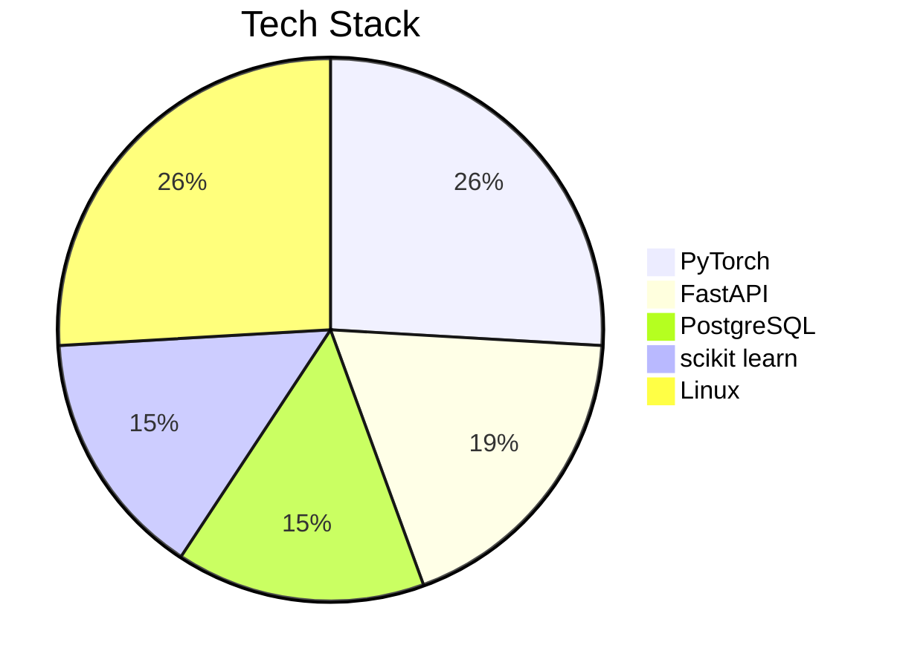

# Ibrokhim Nurullaev 
#### *ML Engineer & Systems Architect*
> *"Building intelligent systems at the intersection of algorithms and infrastructure"*


---

## 📊 GitHub Metrics


---

## 🛠️ Tech Stack



---

## 🚀 Featured Projects

### [Hangul Recognition CNN](https://github.com/LokiChan69/hangul-cnn)


| Metric          | Value       |
|-----------------|-------------|
| Accuracy        | 98.2%       |
| Inference Speed | 8ms/image   |
| Framework       | PyTorch     |

```bash
git clone https://github.com/LokiChan69/hangul-cnn
cd hangul-cnn && pip install -r requirements.txt
```

---

## 📈 Contribution Activity
[](https://github.com/LokiChan69)

---


## 📬 Connect

[](https://github.com/LokiChan69)
[](mailto:ibragimnurullayev@gmail.com)

> *"**未来創造**"*
